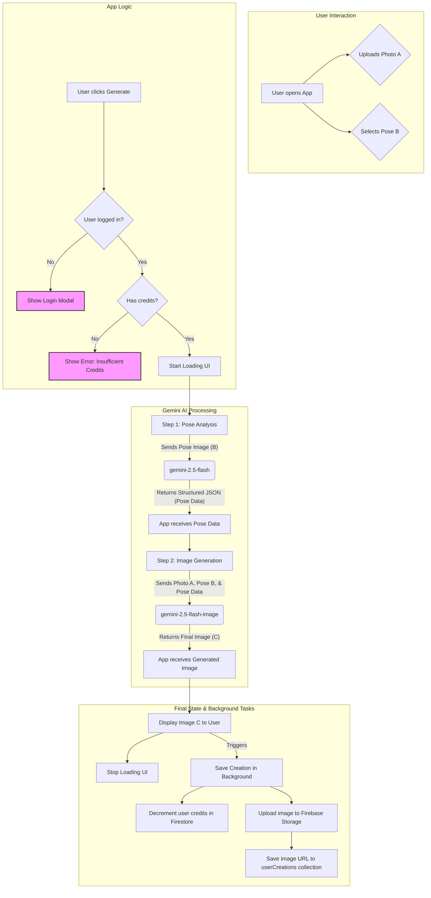

# PoseShift Project Documentation

## 1. Project Overview

**PoseShift** is a web application powered by cutting-edge AI that allows users to transfer the pose from a reference image to their own photo. The core functionality revolves around uploading a personal photo, selecting a pose from a gallery or uploading a custom one, and letting the AI generate a new image that combines the user's likeness, clothing, and background with the selected pose.

**Target Audience:**
The application is designed for a broad audience, including:
*   **Content Creators & Social Media Influencers:** To quickly create dynamic and engaging photos for their platforms.
*   **E-commerce Managers:** To generate consistent and varied product try-on images without expensive photoshoots.
*   **Designers & Artists:** For rapid character concepting, storyboarding, and creative exploration.
*   **General Users:** For fun, creative photo editing and rescuing "almost perfect" photos ruined by a bad pose.

**Core Features:**
*   User-friendly interface for uploading a source image and a pose image.
*   Extensive gallery of predefined pose templates categorized for easy browsing.
*   Ability to upload custom pose images.
*   AI-powered generation engine that preserves user identity, clothing, and background.
*   User authentication system (Email/Password & Google) for managing creations and credits.
*   Credit-based system for image generation with a free trial for new users.
*   User account management for viewing past creations, managing billing, and updating settings.
*   A blog with tutorials, product updates, and company news.
*   Internationalization support for English and Chinese.

---

## 2. Project Flowchart

This diagram illustrates the primary user journey and the two-step AI processing pipeline.



---

## 3. Version Management

### 3.1 Current Version
The current version, as specified in `metadata.json`, is **"测试开发版251107-- AI Pose Shifter"**. This is a development-phase identifier.

### 3.2 Recommended Versioning Scheme
For production and structured development, we will adopt **Semantic Versioning (SemVer)** using the `MAJOR.MINOR.PATCH` format:
*   **MAJOR** version for incompatible API or major feature changes.
*   **MINOR** version for adding functionality in a backward-compatible manner.
*   **PATCH** version for backward-compatible bug fixes.

Example: `1.0.0`

### 3.3 Changelog
A `CHANGELOG.md` file should be maintained in the project root to document all notable changes for each version. This provides transparency for both the development team and users.

### 3.4 Branching Strategy
A simplified Gitflow branching strategy is recommended:
*   `main`: Contains production-ready, deployable code.
*   `develop`: The integration branch for new features. All feature branches are merged into `develop`.
*   `feature/<feature-name>`: Developers create feature branches from `develop` to work on new functionalities (e.g., `feature/batch-processing`). Once complete, they are merged back into `develop`.
*   `hotfix/<fix-name>`: For urgent production bug fixes, created from `main` and merged back into both `main` and `develop`.

---

## 4. Technical Stack

The project is built with a modern, serverless-oriented architecture.

*   **Frontend Framework:**
    *   **React 19:** For building the user interface.
    *   **TypeScript:** For static typing, improving code quality and maintainability.
    *   **ReactDOM:** For rendering React components in the browser.

*   **Styling:**
    *   **Tailwind CSS:** A utility-first CSS framework for rapid UI development, loaded via a CDN script in `index.html`.

*   **AI & Machine Learning (API Interfaces):**
    *   **Google Gemini API (`@google/genai`):** The core engine for all AI-driven tasks.
        *   `gemini-2.5-flash`: Used for analyzing poses from images and generating structured JSON descriptions (see `generatePoseDescription` in `geminiService.ts`).
        *   `gemini-2.5-flash-image`: Used for the primary task of generating the final image by combining the user photo with the analyzed pose (see `generatePoseImage` in `geminiService.ts`).

*   **Backend as a Service (BaaS):**
    *   **Firebase (Compat SDK v9):** Provides a comprehensive suite of backend services.
        *   **Firebase Authentication:** Handles user sign-up, login (Email/Password, Google), and session management.
        *   **Firestore:** A NoSQL database used to store user profiles (including credit balance) and metadata for user-generated creations.
        *   **Firebase Storage:** Used to store the actual image files generated by users.

*   **Tooling & Environment:**
    *   **ES Modules & Import Maps:** The project uses native browser ES modules. Dependencies like React and `@google/genai` are loaded directly from a CDN (`aistudiocdn.com`) via an `importmap` in `index.html`, eliminating the need for a local bundling step (like Webpack or Vite) during development.

---

## 5. Project Structure

The project is organized into logical directories based on functionality.

```
.
├── index.html              # The main HTML entry point for the application.
├── index.tsx               # The main TypeScript file that mounts the React app.
├── README.md               # This documentation file.
├── metadata.json           # Application metadata for the hosting environment.
├── App.tsx                 # The root React component, handling state, routing, and layout.
├── constants.ts            # Stores static data, primarily the pose templates array and categories.
├── components/
│   ├── ImageUploader.tsx     # (DEPRECATED) Legacy component, functionality integrated into App.tsx.
│   ├── PoseGallery.tsx       # (DEPRECATED) Legacy component, functionality integrated into TemplatesPage.tsx.
│   ├── FeaturedPoses.tsx     # Component on the homepage to display a curated set of poses.
│   ├── GeneratedImage.tsx    # Component to display the final AI-generated image, loading states, and errors.
│   ├── PricingSection.tsx    # Component detailing subscription and credit pack pricing.
│   ├── Testimonials.tsx      # Displays user testimonials in a scrolling animation.
│   ├── Faq.tsx               # An accordion-style FAQ component.
│   ├── Footer.tsx            # The site-wide footer.
│   ├── ContactModal.tsx      # A modal for displaying contact information.
│   ├── icons.tsx             # A collection of SVG icons used throughout the app.
│   └── auth/
│       └── AuthModal.tsx       # Modal for user login and signup.
│   └── account/
│       ├── MyCreations.tsx     # Tab content for viewing user's saved creations.
│       ├── Billing.tsx         # Tab content for viewing and managing billing/plans.
│       ├── Credits.tsx         # Tab content for viewing credit balance and history.
│       └── AccountSettings.tsx # Tab content for managing user profile information.
├── contexts/
│   └── AuthContext.tsx       # React Context for managing global authentication state and user profile data.
├── pages/
│   ├── AccountPage.tsx       # The main page for user account management, which renders different tabs.
│   ├── BlogPage.tsx          # The blog page, which displays a list of articles and a detail view.
│   ├── TemplatesPage.tsx     # A full-page gallery of all available pose templates.
│   └── legal/
│       ├── LegalContent.tsx    # Contains the JSX content for all legal pages.
│       ├── LegalPage.tsx       # A component that renders the correct legal content based on a 'type' prop.
│       └── LegalPageLayout.tsx # The shared layout/styling for all legal pages.
├── services/
│   ├── geminiService.ts      # Contains all logic for interacting with the Google Gemini API.
│   └── firebase.ts           # Initializes and exports Firebase services (Auth, Firestore, Storage).
└── utils/
    └── fileUtils.ts          # Utility functions for file handling (e.g., base64 conversion, downloading).
```

---

## 6. Core Features and Logic (API Interfaces)

### 6.1 Authentication Flow
1.  **Provider (`AuthContext.tsx`):** This context wraps the entire application. It listens for `onAuthStateChanged` from Firebase to track the current user.
2.  **Profile Sync:** When a user logs in, the context fetches their corresponding profile from the "userProfiles" collection in Firestore to get additional data like credit count. It uses an `onSnapshot` listener to keep this data in sync in real-time.
3.  **New User Creation:** Upon signup (or first-time Google login), a new document is created in the "userProfiles" collection, and the user is granted an initial 30 credits.
4.  **UI Integration:** The `useAuth()` hook provides user data to components. This is used in the `Header` to show either "Log In/Sign Up" buttons or the user menu, and in `App.tsx` to gate the image generation functionality.

### 6.2 Image Generation Workflow (API Usage)
This is the core logic of the application, orchestrated within `App.tsx`'s `handleGenerate` function and implemented in `geminiService.ts`.

1.  **User Action:** The user uploads a photo (Image A) and selects a pose (Image B).
2.  **Pre-flight Checks:** `handleGenerate` in `App.tsx` is triggered. It first checks if the user is logged in and has sufficient credits.
3.  **Loading State:** The application enters a loading state, providing feedback to the user.
4.  **Pose Analysis API Call (Step 1):** The `generatePoseDescription` function in `geminiService.ts` is called.
    *   **Model:** `gemini-2.5-flash`
    *   **Input:** The pose image (Image B) and a prompt instructing the model to analyze the pose and ignore any other elements.
    *   **Configuration:** It uses `responseMimeType: "application/json"` and a detailed `responseSchema` to force the model to return a structured JSON object describing the pose (head position, arm angles, etc.). This structured data is crucial for precise replication.
5.  **Image Generation API Call (Step 2):** The `generatePoseImage` function in `geminiService.ts` is called.
    *   **Model:** `gemini-2.5-flash-image`
    *   **Input:** A multi-part request containing:
        *   The user's photo (Image A).
        *   The pose reference photo (Image B).
        *   A detailed text prompt that includes the structured JSON pose data from Step 1 as the "ground truth", along with a set of critical rules for the AI.
    *   **Configuration:** It uses `responseModalities: [Modality.IMAGE]` to instruct the model to return an image.
6.  **Result Handling:** The model returns the final image as a base64 string.
7.  **State Update:** `App.tsx` updates its state with the new image, displaying it in the `GeneratedImage` component, and turns off the loading state.
8.  **Background Save:** The `saveCreationInBackground` process is kicked off to:
    *   Convert the base64 image to a Blob.
    *   Upload the Blob to Firebase Storage.
    *   Get the public download URL.
    *   Decrement the user's credit count in their Firestore profile document using a `FieldValue.increment` operation.
    *   Create a new document in the "userCreations" collection linking the user's ID to the image URL.

### 6.3 State-Based Routing
The application uses a simple routing mechanism controlled by a `useState` hook in `App.tsx`: `const [page, setPage] = useState<Page>('home');`. The `navigate` function updates this state. A `switch` statement in `renderContent` determines which top-level page component to render. The `navigate` function also handles scrolling to anchor IDs (e.g., `#pricing-section`) for smooth navigation within the homepage.

---

## 7. Getting Started (Usage Instructions)

### 7.1 Prerequisites
*   A modern web browser with support for ES Modules (Chrome, Firefox, Safari, Edge).
*   A local web server to serve the files. The VS Code "Live Server" extension is a simple option.

### 7.2 Environment Variables
The application requires a Google Gemini API key to function.
1.  This key must be made available as an environment variable named `process.env.API_KEY`.
2.  Since this is a client-side application without a build step, `process.env` is not available by default. The hosting environment or a local development setup must inject this variable. For simple local testing, you could temporarily hardcode it in `geminiService.ts`, but **this is not recommended for production or any public repository**.

### 7.3 Running Locally
1.  Clone the repository.
2.  Configure your Gemini API key as described above.
3.  Start a local web server in the project's root directory.
    *   Using VS Code Live Server: Right-click `index.html` and select "Open with Live Server".
    *   Using a terminal: `npx serve`
4.  Open the provided URL (e.g., `http://127.0.0.1:5500` or `http://localhost:3000`) in your browser.

---

## 8. Environment Portability Guide

This project was originally built and optimized for the **AI Studio sandbox environment**. Migrating it to a different development, staging, or production environment requires addressing several key differences that the sandbox handles automatically.

### 8.1 Gemini API Key Management

*   **AI Studio Behavior:** The Gemini API key is securely injected into the environment and made available via `process.env.API_KEY`.
*   **External Environment Issue:** Standard client-side JavaScript does not have access to `process.env`. Making API calls directly from the client exposes your API key, which is a major security risk.
*   **Recommendations:**
    *   **High-Security (Production):** The best practice is to **create a backend proxy**. Set up a serverless function (e.g., Firebase Cloud Function, Vercel Serverless Function) that receives the request from your frontend. This function, running on a server, will securely store the API key and make the call to the Gemini API on the client's behalf. This is the only way to completely protect your key.
    *   **Local Development (with a build tool):** If you set up a build tool like Vite, you can use a `.env.local` file to store a variable like `VITE_GEMINI_API_KEY="..."`. You would then access it in your code via `import.meta.env.VITE_GEMINI_API_KEY`. This is for local testing only and does not solve the production security issue.

### 8.2 Dependency Management (CDN vs. NPM/Yarn)

*   **AI Studio Behavior:** The project uses an `importmap` in `index.html` to load dependencies like React and `@google/genai` directly from a CDN. This simplifies the setup by avoiding `node_modules` and a build step.
*   **External Environment Consideration:** While this approach is fast for prototyping, it offers less control over package versions and misses out on optimizations like tree-shaking and bundling that improve performance.
*   **Recommendations:**
    1.  **Initialize a Package Manager:** In the project root, run `npm init -y` to create a `package.json` file.
    2.  **Install Dependencies:** Run `npm install react react-dom @google/genai firebase`.
    3.  **Set Up a Build Tool:** Integrate a modern build tool like **Vite**. It's fast, simple to configure, and provides a local development server with Hot Module Replacement (HMR).
    4.  **Update `index.html`:** Remove the `<script type="importmap">` tag. Change the module script from `<script type="module" src="/index.tsx"></script>` to `<script type="module" src="/src/index.tsx"></script>` (or whatever your Vite entry point is). Vite will handle the bundling.

### 8.3 Firebase Security

*   **AI Studio Behavior:** The focus is on rapid prototyping, and Firebase security may not be a primary concern.
*   **External Environment Requirement:** In any public-facing application, securing your Firebase backend is **critical**.
*   **Recommendations:**
    *   **Firestore Security Rules:** In the Firebase console, you **must** configure Firestore rules to prevent unauthorized data access. Users should only be able to read and write their own data.
        *   *Example Rule:* `match /userProfiles/{userId} { allow read, update: if request.auth.uid == userId; }`
    *   **Firebase Storage Rules:** Similarly, configure Storage rules to ensure users can only upload files associated with their UID and can only read their own files.
    *   **API Key Restriction:** In the Google Cloud Console, restrict your Firebase API key. Add HTTP referrer restrictions so the key can only be used from your application's domain (`https://your-app-domain.com/*`). This prevents unauthorized use of your Firebase project on other websites.
